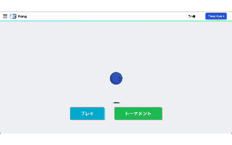
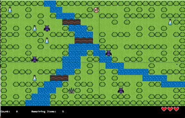

# Hi! I'm Yuina Hirai👋

  
  

  

# Projects
[ft_minecraft (Minecraft fan recreation project)](https://github.com/sakura100mochi/ft_minecraft)

  
Duck Adventure (Roblox)🐥

  

  <a href="https://www.roblox.com/share?code=6b3c6e1e72791a468650afb9a176e2c7&type=ExperienceDetails&stamp=1780847018882">
    🐥Game Link🐥
  </a>

  

[My Roblox Library](https://github.com/sakura100mochi/Roblox)

[Defeat the Enemies! (A simple 2D action game)](https://github.com/sakura100mochi/pygame)

ft_transcendance

> This is a Pong game on the web.
>
> Skills:
> 

  

so_long

  
> This is a 2D maze game.
> 
> Skills: C, MiniLibX

  

